# Photo3D sul campo

Fotografi un oggetto o uno scavo col telefono, il tuo computer costruisce il modello 3D.
Questa guida ti porta dall'installazione al modello condiviso, un passo alla volta. Non
serve saper usare il terminale: dove c'è un comando, si copia e si incolla.

> App (iPhone · iPad · Android) → Server (Mac · Windows · Linux) → Motore (Metashape · WebODM) → Modello 3D

Versione impaginata: [`docs/guida.html`](guida.html) (scaricala e aprila nel browser).

---

## 1. Installa il server sul computer

Il server riceve le foto e comanda l'elaborazione. Si installa una volta sola, sul computer
che farà i calcoli.

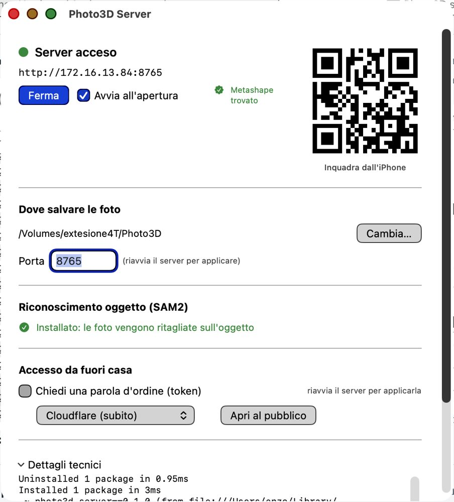

**macOS** — apri `Photo3DServer.dmg`, trascina **Photo3D Server** su **Applicazioni**, aprila
dal Launchpad e premi **Avvia**. La finestra mostra il semaforo di stato, la cartella di
salvataggio e un **QR** per l'app.

**Windows** — scompatta `Photo3DServer-Windows.zip` e fai doppio click su `photo3d-server.exe`
(oppure tasto destro su `avvia-server.ps1` → *Esegui con PowerShell*). Alla richiesta di
Windows sulla rete, scegli **Consenti** sulle reti private.

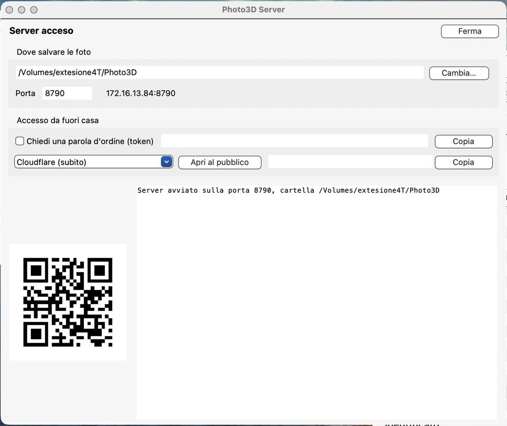

**Linux**

```bash
sudo apt install ./photo3d-server_1.0.0_amd64.deb
sudo systemctl enable --now photo3d
systemctl status photo3d      # sta girando?
journalctl -u photo3d -f      # cosa sta facendo
```

> **Dove finiscono le foto.** Il server usa il primo disco esterno che trova, altrimenti la
> cartella Immagini. La cambi dalla finestra sul Mac o dall'app, per ogni sessione.

## 2. Scegli il motore di calcolo

| Motore | Costo | Quando conviene |
|---|---|---|
| **Agisoft Metashape Pro** | Licenza | Oggetti e reperti: scala col tocco, unione di due riprese, risultati migliori sulle superfici difficili |
| **WebODM (NodeODM)** | Gratuito | Rilievi da drone e topografia, o computer senza licenza. Su Linux con NVIDIA è molto veloce |

**Metashape**: installalo nella posizione predefinita, il server lo trova da solo
(`/Applications`, `C:\Program Files\Agisoft`, `/opt/metashape-pro`).

**WebODM**: installa Docker Desktop, poi una volta sola:

```bash
docker run -d -p 3000:3000 --name nodeodm --restart unless-stopped opendronemap/nodeodm
```

Con scheda NVIDIA aggiungi `--gpus all`.

## 3. Installa l'app sul telefono

- **iPhone / iPad**: accetta l'invito, installa **TestFlight** e da lì Photo3D.
- **Android**: copia `Photo3D.apk` sul telefono e aprilo (Android chiede una volta di
  consentire l'installazione da questa origine).

Al primo avvio concedi **Fotocamera** e **Rete locale**: senza rete locale l'app non vede il
computer.

## 4. Collega l'app al server

Telefono e computer sulla **stessa Wi-Fi**: di norma l'app trova il server da sola.
Se non lo trova (reti di hotel e uffici): **Impostazioni → Manuale**, poi inquadra il **QR**
della finestra sul Mac o scrivi indirizzo (es. `172.16.13.84`) e porta `8765`.

## 5. Scatta le foto

Premi **+**, dai un nome, scegli qualità e motore, poi **Scatta foto** (oppure importa dalla
galleria: le HEIC vengono convertite da sole).

- Uno scatto **ogni 10–15°**: circa 30 foto per giro.
- Sovrapposizione **almeno del 60%** tra una foto e la successiva.
- Due o tre giri ad altezze diverse: dall'alto, di tre quarti, di lato.
- Luce uniforme, niente ombre nette né flash; l'oggetto sta fermo.
- Metti in campo una **stecca metrica**: servirà per le misure.

**Foto da drone.** Vola con DJI Fly usando i **waypoint** con scatto a intervallo, poi porta le
foto sul tablet (Quick Transfer o lettore di schede) e usa **Aggiungi da File o scheda SD**: si può
scegliere l'intera cartella `DCIM`, senza passare dal rullino. Photo3D non comanda il drone: il volo
si fa con l'app del produttore (alcuni DJI — Mini 3/4 Pro e linea Enterprise — sarebbero pilotabili
da app di terze parti col Mobile SDK v5, ma solo su Android e col telefono collegato al telecomando).

> **Lo zoom resta a 1×** per tutta la sessione: la fotogrammetria richiede la stessa focale in
> ogni scatto. Per riempire l'inquadratura, avvicinati.

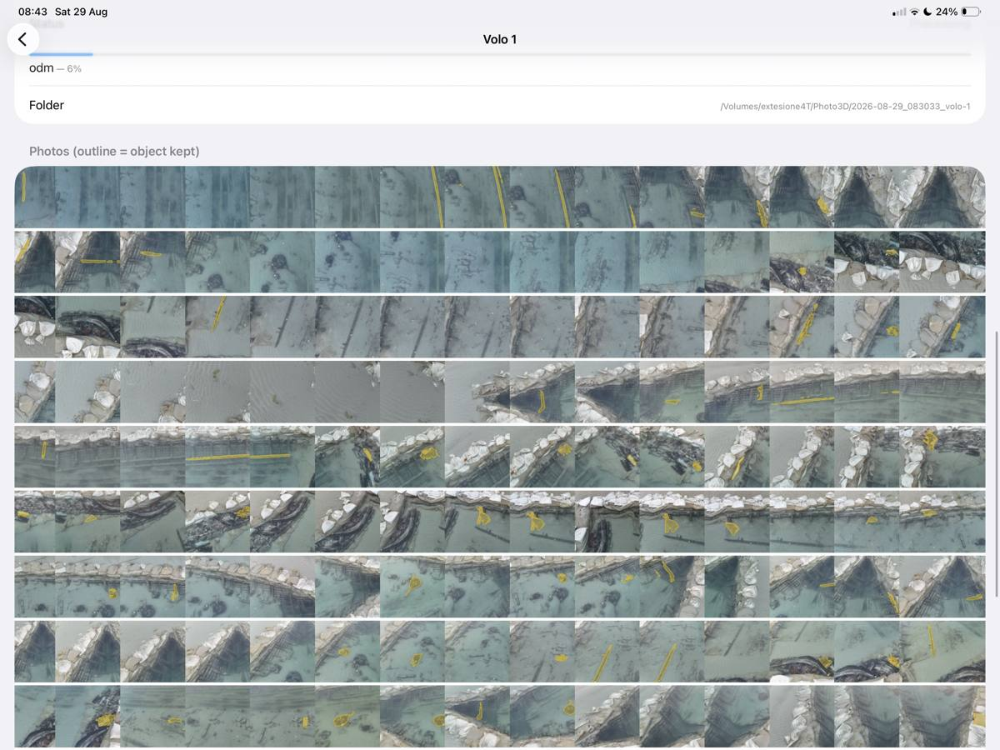

## 5b. Volare col drone (app Android)

Con un telefono **Android** Photo3D pilota i droni DJI supportati dal Mobile SDK v5: Mini 3,
Mini 3 Pro, **Mini 4 Pro**, Mavic 3 Enterprise / 3T / 3M, Matrice 30, 4E/4T, 300 e 350.

### Collegare il telefono al telecomando

Il telefono parla col **telecomando**, non col drone: serve il cavo, non il Wi-Fi.

1. Metti il telefono nella pinza del telecomando (RC-N2 per il Mini 4 Pro; sui telecomandi con
   schermo integrato, tipo RC 2, non si possono installare app di terze parti).
2. Collega il **cavo dati USB-C ↔ USB-C** di DJI. Dev'essere un cavo **dati**: quelli da sola
   ricarica non funzionano e non danno alcun errore.
3. Accendi prima il **telecomando**, poi il **drone**, e aspetta l'aggancio.
4. **Chiudi DJI Fly**: due app non possono usare il telecomando insieme.
5. Apri Photo3D → sessione → **Drone**; alla richiesta di accesso al dispositivo USB rispondi **OK**.

In cima alla schermata leggi lo stato: *Registrazione con DJI…*, poi **modello e batteria** del
drone collegato.

### Disegnare l'area

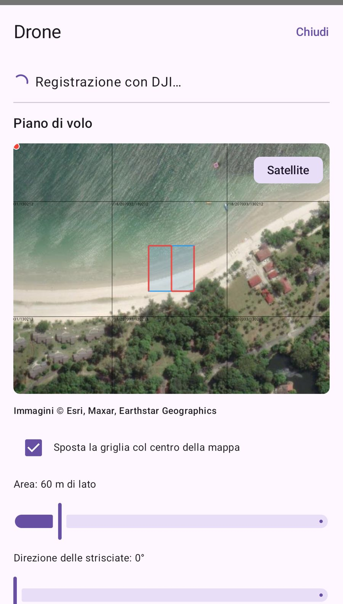

- **Spostare**: trascina la mappa, la griglia resta al centro (la spunta la tiene agganciata).
- **Ingrandire/rimpicciolire**: cursore **Area**, da 20 a 300 m di lato.
- **Ruotare**: cursore **Direzione delle strisciate** (0–90°): allineale al lato lungo dello scavo,
  meno virate e copertura più regolare.
- **Satellite o mappa**: pulsante in alto a destra.

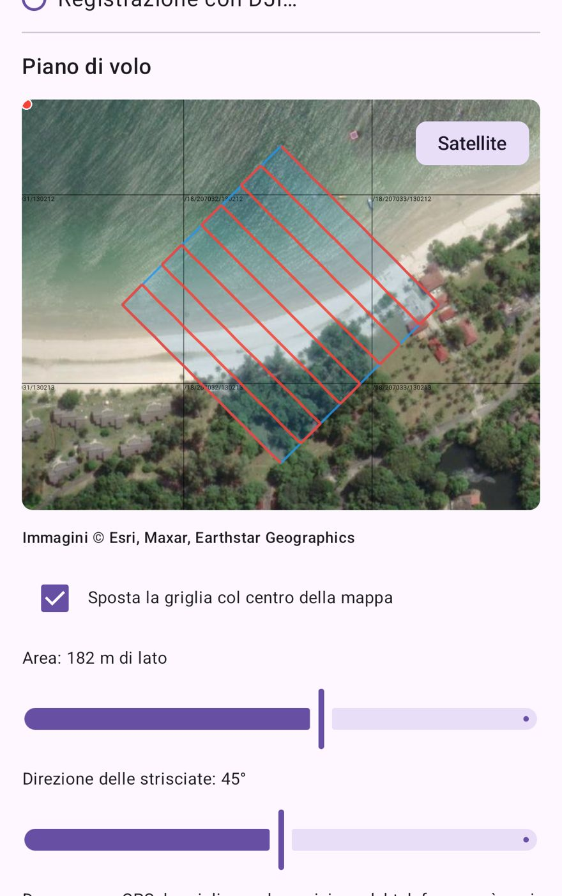

### Quota, sovrapposizioni e minuti di volo

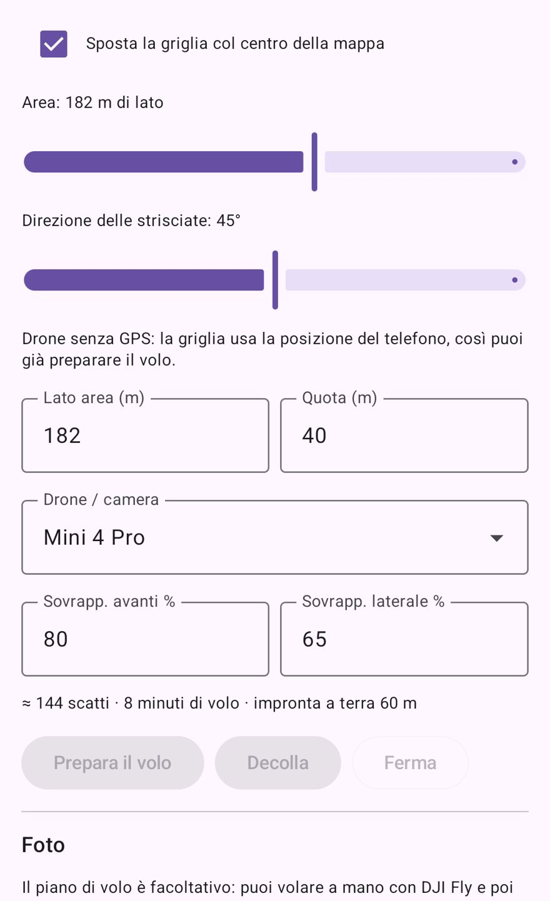

La **quota** decide tutto: raddoppiandola ogni foto copre il doppio di terreno, gli scatti calano
in fretta ma cala anche il dettaglio. Le **sovrapposizioni** consigliate sono 80% avanti e 65%
laterale.

| Area | Quota | Impronta | Scatti | Volo | Dettaglio |
|---|---|---|---|---|---|
| 50×50 m | 30 m | 45 m | 24 | ~2 min | ~0,6 cm/px |
| 100×100 m | 30 m | 45 m | 84 | ~4 min | ~0,6 cm/px |
| 100×100 m | 50 m | 75 m | 28 | ~3 min | ~0,9 cm/px |
| 150×150 m | 30 m | 45 m | 170 | ~7 min | ~0,6 cm/px |
| 150×150 m | 50 m | 75 m | 66 | ~5 min | ~0,9 cm/px |
| 200×200 m | 30 m | 45 m | 299 | ~12 min | ~0,6 cm/px |
| 200×200 m | 50 m | 75 m | 112 | ~8 min | ~0,9 cm/px |

Una batteria dura circa **15–20 minuti reali**: resta sotto i 10 di volo pianificato. Per un'area
di scavo, **30–40 m di quota** danno meno di un centimetro per pixel.

### Far volare

1. **Prepara il volo** — la missione viene generata e caricata sul drone.
2. **Decolla** — il drone vola la griglia scattando e poi rientra da solo.
3. **Ferma** — interrompe; i comandi del telecomando restano sempre prioritari.

### Oppure vola come vuoi

Il piano è facoltativo: vola a mano con DJI Fly (utile per pareti di taglio e strutture verticali),
poi chiudi DJI Fly, apri Photo3D e usa **Riprendi le foto dal drone**.

> Su iPhone e iPad il pilotaggio non è possibile: DJI pubblica il Mobile SDK v5 solo per Android
> (per iOS resta la v4, ferma al 2022). Su iPad si vola con DJI Fly e si importa con
> *Aggiungi da File o scheda SD*.

## 6. Isola l'oggetto (facoltativo)

Quando vuoi **solo il reperto**, senza tavolo e sfondo: apri una foto e **tocca l'oggetto**.
Il computer lo riconosce nelle altre foto e le mostra con un contorno giallo.

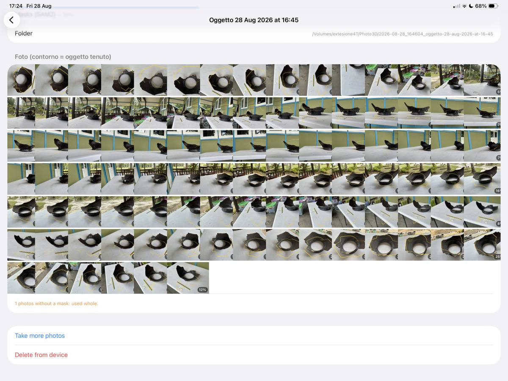

> Nei rilievi di scavo o da drone **non serve**: lì l'oggetto è il terreno. Senza tocco non
> viene fatta alcuna maschera.

## 7. Dai la misura reale

Nella sezione **Scala metrica** (con Metashape):

1. **Tocca la barra su una foto** — scegli la foto dove la stecca si vede meglio, ingrandisci
   fino a 16×, tocca i due estremi, scrivi i millimetri. È il modo più preciso.
2. **Trova la stecca da solo** — accendi l'interruttore e indica la lunghezza.
3. **Target codificati** — indica la distanza fra due target stampati da Metashape.

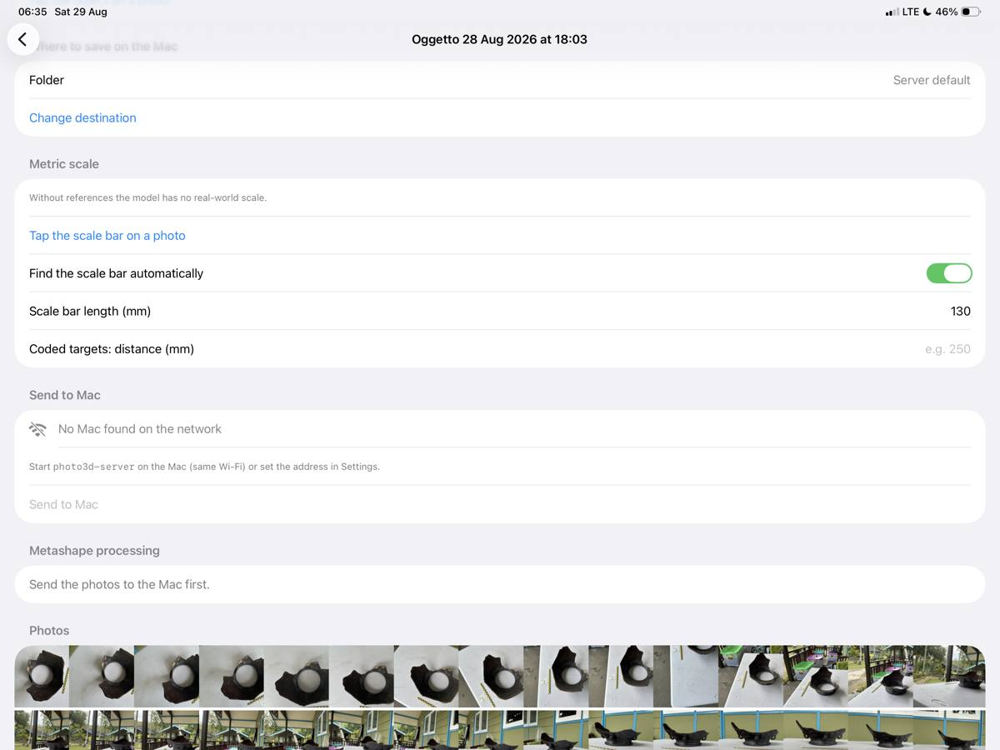

**Topografia (GCP)**: con **Punti di controllo (GCP)** scegli la foto, ingrandisci, tocca il
punto a terra e scrivi Est, Nord e Quota. Funziona con **entrambi** i motori; con le foto da
drone la georeferenziazione avviene già col GPS.

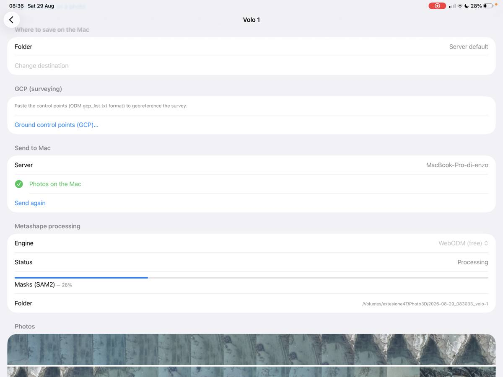

## 8. Invia ed elabora

**Invia al Mac**: il caricamento prosegue anche a schermo bloccato e riprende da dove si era
interrotto. L'elaborazione parte da sola e mostra fase e percentuale.

Tempi indicativi: reperto con 100 foto in qualità media, 20–40 minuti; volo di drone con 180
foto, fino a un'ora. Puoi chiudere l'app: il lavoro è sul computer.

## 9. Guarda il modello e prendi le misure

**Vedi modello 3D**: si gira con le dita, lo sfondo si sceglie col selettore colore. La prima
apertura scarica il modello, poi è immediato.

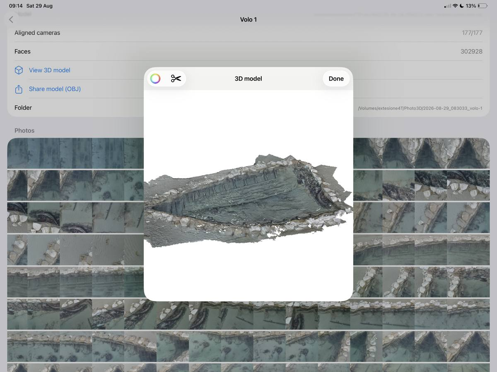

**Sezioni e profili**: tocca le **forbici**, gira il modello come vuoi disegnarlo, **tocca due
punti**, poi scegli il taglio:

- **Come lo vedo** — profilo di un vaso o di un coccio;
- **Lungo la linea** — sezione di un terreno.

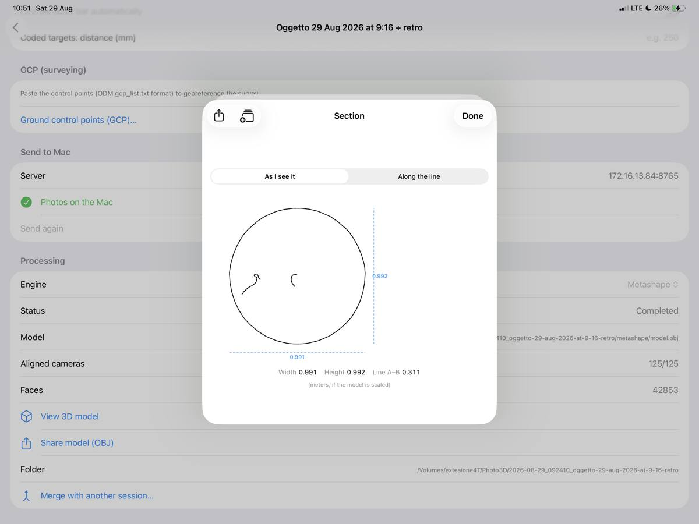

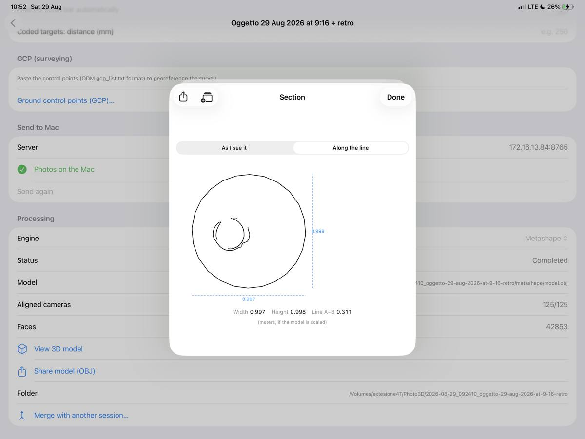

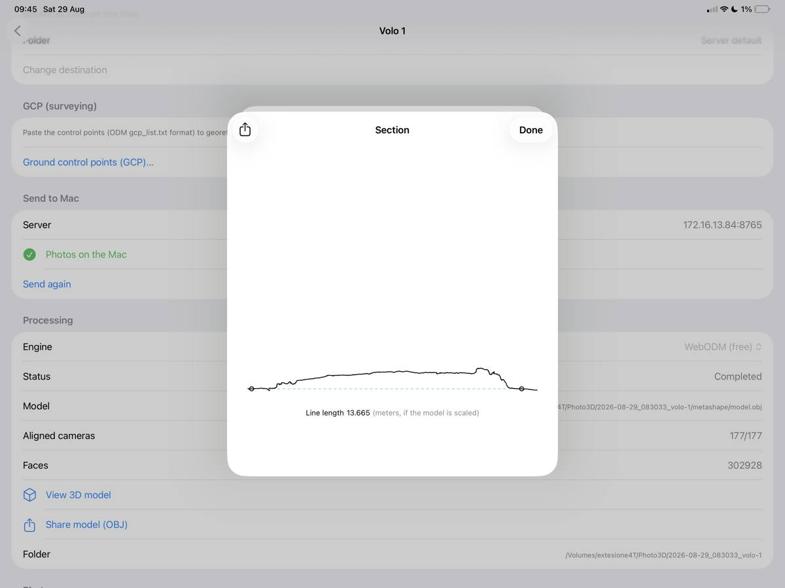

Vengono riportate larghezza, altezza e lunghezza della linea (il righello le accende e le
spegne). Con **Aggiungi alla tavola** ogni sezione prende una lettera (A–A1, B–B1) che compare
anche **sul modello**, dove hai tagliato; la tavola si riordina e si condivide come immagine.

## 10. Unisci due riprese dello stesso oggetto

Fotografa l'oggetto in due posizioni (dritto e capovolto) come due sessioni, elaborale
entrambe, poi **Unisci con un'altra sessione…**:

- **Allinea le posizioni** (consigliato): funziona anche su superfici scure e uniformi;
- **Solo maschere**: per oggetti molto ricchi di dettagli.

Se le due metà non si agganciano l'app lo dice, invece di consegnare un risultato sbagliato:
servono più foto di raccordo che inquadrino le stesse zone in entrambe le posizioni.

## 11. Condividi il risultato

- **Condividi modello (OBJ)**: zip con geometria e texture (Blender, MeshLab, CloudCompare).
- **Sezioni e tavole**: immagini pronte per la relazione.
- Sul computer, nella cartella della sessione, c'è anche la **nuvola di punti** (`.ply` o
  `.laz` georeferenziata) per QGIS e CloudCompare.

Le sessioni fatte da altri dispositivi si aprono dall'icona **disco con onde** nella lista.

## 12. Lavorare da fuori casa

In rete locale non serve altro. Da un'altra rete o in 4G il computer apre un collegamento
sicuro (HTTPS) e l'app usa una parola d'ordine, il **token**.

**Sul Mac**, nella finestra di Photo3D Server, sezione **Accesso da fuori casa**:

1. accendi **Chiedi una parola d'ordine (token)** — viene creata al momento e mostrata col
   bottone per copiarla (riavvia il server perché la applichi);
2. scegli **Cloudflare (subito)** o **Tailscale (indirizzo fisso)** e premi **Apri al pubblico**;
3. quando compare l'indirizzo `https://…` col lucchetto verde sei online; **Chiudi** lo spegne.

Il **QR** della finestra si aggiorna da solo: inquadrandolo, l'app riceve insieme indirizzo
pubblico e parola d'ordine.

**Su Windows e Linux**:

```bash
scripts/tunnel.sh        # Linux e macOS: indirizzo + parola d'ordine
scripts/tailscale.sh     # indirizzo che non cambia mai
```

Su Windows: tasto destro su `tunnel.ps1` → *Esegui con PowerShell* (solo la parola d'ordine:
`genera-token.ps1`).

Nell'app: **Impostazioni → Manuale**, indirizzo `https://…` e parola d'ordine nel campo
**Token** — oppure inquadra il QR.

> **La parola d'ordine vale sempre.** Finché è accesa il server rifiuta le richieste che non la
> portano, anche in casa: mettila su tutti i dispositivi, o spegnila mentre lavori in locale.

---

## Se qualcosa non va

| Sintomo | Rimedio |
|---|---|
| "Nessun Mac trovato sulla rete" | Controlla: telefono in Wi-Fi (non 4G), permesso **Rete locale** acceso, server avviato. Se resta così, la rete blocca la ricerca automatica: indirizzo a mano in Impostazioni → Manuale |
| Errore 401 dove prima funzionava | È accesa la **parola d'ordine**: inquadra di nuovo il QR (la porta con sé) o copiala dalla sezione *Accesso da fuori casa*. Se il telefono ha una versione vecchia dell'app, aggiornala o spegni l'interruttore mentre lavori in casa |
| Caricamento lentissimo | Wi-Fi condivisa: usa l'**hotspot del telefono** col computer collegato ad esso, o il cavo. L'invio prosegue a schermo bloccato |
| "Poche foto allineate" | Le foto non si legano: scatti più ravvicinati (10–15°), luce costante, niente sfocature né zoom. Superfici lucide, nere o senza dettaglio sono le più difficili |
| Il contorno giallo prende lo sfondo | Tocca l'oggetto su una foto **più chiara e ravvicinata**: quel tocco è il riferimento per tutte. Sui terreni, spegni le maschere |
| Misure tipo 0,99 · 1,00 | Il modello non è in scala: imposta la **scala metrica** e rilancia con **Applica la scala** |
| Il profilo del vaso esce ad anello | Stai guardando il pezzo **dall'alto**: giralo di lato (orlo in alto), tocca i due estremi della sagoma, usa **Come lo vedo** |
| "Le due posizioni non si agganciano" | Aggiungi **foto di raccordo** che inquadrino le stesse parti in entrambe le posizioni, poi riprova con **Allinea le posizioni** |
| Con WebODM non parte niente | Apri **Docker Desktop** e verifica che il contenitore `nodeodm` sia in esecuzione; se manca, rilancia il comando del passo 2 |
| Il modello sembra un'immagine ferma | Trascina con **un dito** per ruotare, due dita per lo zoom. Con le forbici attive il primo tocco piazza un punto: toccale di nuovo per uscire |
| macOS: "sviluppatore non identificato" | Stai aprendo una copia vecchia: usa il **DMG firmato** e trascina l'app in Applicazioni |
| macOS: premo Avvia e il server non parte | Se salvi su un **disco esterno**, autorizza l'app: Impostazioni di Sistema → **Privacy e sicurezza → File e cartelle** → attiva **Photo3DServer** (serve dopo ogni aggiornamento) |
| Linux: il servizio non parte | `journalctl -u photo3d -f` — quasi sempre è la porta occupata da un altro server già avviato |
